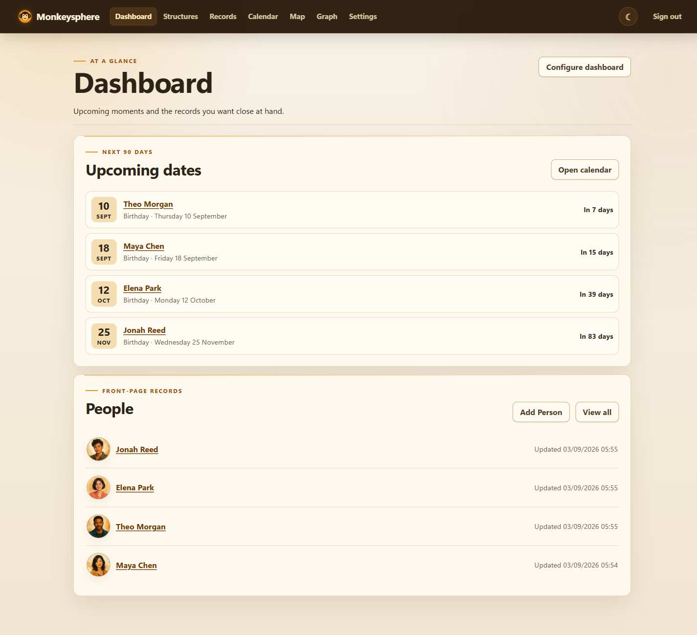
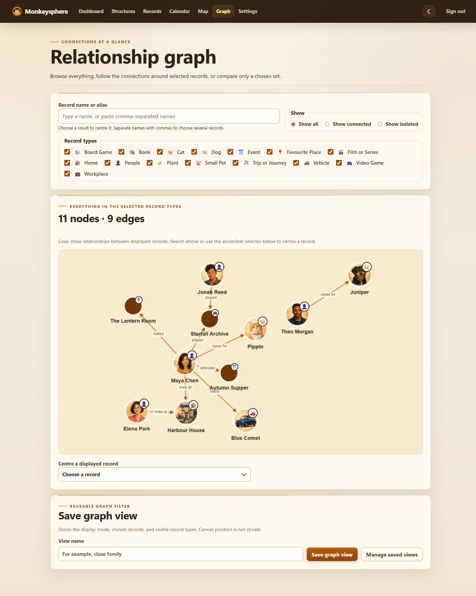
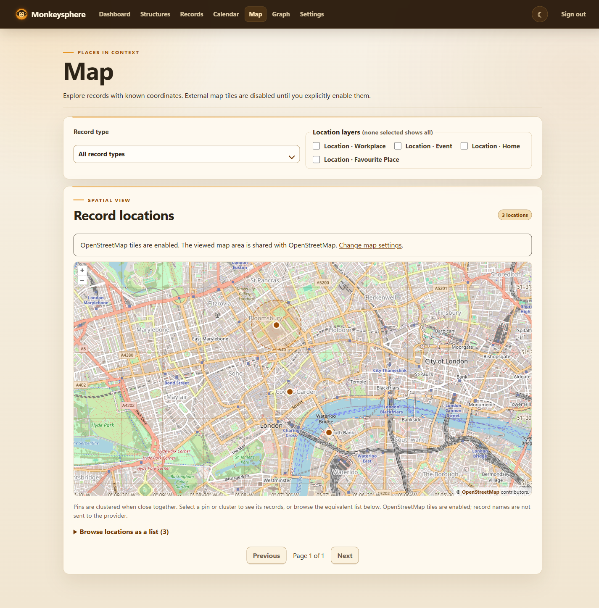

# Monkeysphere

Monkeysphere is an open-source, private, self-hosted relationship-memory application for records about people, pets, places, interests, and administrator-defined entity types. It is a work in progress preparing for its initial alpha release.

## Screenshots

All screenshots use a fictional demonstration dataset.



The Dashboard keeps upcoming recurring dates and selected record categories together.



The relationship graph can show the whole selected sphere or focus on chosen records and their connections.



The map plots known coordinates, clusters nearby records, and visualizes approximate areas. External basemap tiles are off by default and require an explicit administrator choice in Settings.

## Current vertical slice

The current slice provides one administrator account, independently selectable data domains, configurable record types and reusable typed fields, previewed field and record-type schema evolution, record editing, searchable alternate names, rich multi-image records, structured locations, directional and symmetric relationships, reusable saved record and graph views, a configurable Dashboard, an exact-date calendar with an upcoming-date list, private in-app reminders, manual iCalendar export, previewed vCard contact import and scoped export, bounded search/filtering, SQLite/Dapper persistence, checksummed DnaX migrations, and disabled-by-default read-only HTTP API and MCP surfaces. The renameable Default domain preserves existing data, while additional domains have isolated databases, media, setup, structures, records, and projections. Every record has one primary display name and can have multiple aliases, nicknames, short names, former names, and images. New domains open a four-level setup wizard with concrete examples, customizable preset selection, and a persistent blank-slate option. The catalogue currently ships 15 editable, versioned record-type presets with canonical field keys and applicable packaged relationships. Saved record views package one record type, selected columns, up to ten filters, optional grouping, and display-name or field sorting; saved graph views retain their display mode, selected records, and enabled record types. The Dashboard can show multiple ordered record categories and recurring upcoming dates, defaulting to People and birthdays when those presets are installed. The calendar can be filtered by record type and date field; it places exact-date values and non-approximate day-precision temporal values, while deliberately withholding coarser or approximate values from exact day cells. Authenticated users can schedule several local lead times, dismiss reminders, and download the selected month as a standards-compatible `.ics` file; Monkeysphere does not send reminder details to an outside service. The import/export page accepts bounded UTF-8 vCard 3.0 and 4.0 files for the Person preset, previews standard mappings and possible duplicates against both saved records and earlier contacts in the same domain and file, applies explicit create/skip/merge/replace choices in one transaction, semantically preserves unsupported properties and Apple labels, and exports only deliberately selected contacts as vCard 4.0. Recognized fields include text, multiline text, number, exact date, choice, tags, precision-aware temporal values, phone numbers, web links, and locations; unknown type identifiers retain a lossless text fallback.

## Requirements

- .NET SDK 10.0.300 or a compatible later 10.0 feature band.
- Windows PowerShell 5.1 for repository scripts.
- No credential setup is required for local testing. Configure a non-default administrator password before exposing a deployment outside a trusted local environment.

No Node.js or Python toolchain is used.

## Build and test

```powershell
.\eng\Build.ps1
```

### Test in VS Code

Open the repository root in VS Code, install the recommended C# Dev Kit extension if prompted, and press `F5`. Select **Monkeysphere Web** if VS Code asks for a configuration. The browser opens at `http://localhost:5080`; sign in with username `admin` and password `admin`.

VS Code stores this test deployment beneath the ignored `.local/vscode-data` directory so records survive debugging restarts without entering source control. Use **Terminal → Run Task → verify** to run the locked restore, Release build, and complete test suite.

Without credential configuration, Monkeysphere uses `admin` / `admin`. Override the username with `MONKEYSPHERE_ADMIN_USERNAME` and the password with either `MONKEYSPHERE_ADMIN_PASSWORD` or `MONKEYSPHERE_ADMIN_PASSWORD_FILE`. Docker Compose exposes the username and password as interpolated configuration values with the same defaults, so shell variables, a Compose `.env` file, or an override file can replace them.

Then run:

```powershell
.\eng\Run.ps1
```

The default development address is `http://localhost:5080`. Production deployments serve HTTP and must use a correctly configured trusted HTTPS reverse proxy when transport confidentiality is required.

## Optional remote access

HTTP API and MCP support are compiled in but unavailable by default. A deployment must explicitly enable the DnaX master gate and the desired surface, provide a stable deployment identifier, configure the trusted HTTPS/proxy boundary, and restart. The administrator can then create a one-time credential, rotate the randomized endpoint, and activate that surface from the Remote access page. API and MCP use separate credentials; anonymous MCP is not supported.

The first remote scope is `records.read`. It permits bounded domain and record-type listing, record search, and individual record retrieval only. HTTP requests default to the Default domain and select another with its ID in `X-Monkeysphere-Domain`; MCP record tools accept the same ID as an optional `domainId`. Invalid explicit selectors fail closed. See [security](docs/security.md) for excluded operations and the trust boundary.

## Data

`MONKEYSPHERE_DATA_ROOT` selects the mutable data root and defaults to `data` beneath the content root. The domain catalogue, each domain's application data, and DnaX remote-access state use separate SQLite files and migration ledgers. The original `monkeysphere.db` remains the Default domain for backwards compatibility; additional domains use opaque directories beneath `domains/`.

The authenticated Backups page creates a deployment-wide, versioned `.monkeysphere-backup` package from SQLite online snapshots of the domain registry, every domain database, and remote-access state plus every database-referenced original image. A JSON manifest records the domain catalogue, backup identity, application schema version, byte lengths, entry kinds, and SHA-256 checksums; the completed package is reopened and validated before it is offered for download. Deployment configuration, data-protection keys, administrator credentials, temporary files, and regenerable image derivatives are deliberately excluded.

Restore is deliberately offline. Stop Monkeysphere, then run the same executable with `--restore-backup <package-path>` and the normal `MONKEYSPHERE_DATA_ROOT` setting. The process acquires the data-root instance lock, stages and revalidates the archive, checks every SQLite database, verifies each DnaX application ledger, domain registry, and original-media reference, replaces the complete domain data set and remote-access state, and retains the previous live data beneath `backups/rollback-*`. Display derivatives are regenerated from originals on first access after restore. Start Monkeysphere normally only after the restore command succeeds.

Scheduled backups default to `Off`. Configure `Monkeysphere__Backups__Frequency` as `Daily`, `Weekly`, or `Monthly`, with `Time`, `TimeZone`, `DayOfWeek`, `DayOfMonth`, and `RetentionCount` in the same configuration section. Docker Compose exposes matching `MONKEYSPHERE_BACKUP_*` variables and defaults to 02:00 UTC, Sunday/day 1, and 12 retained packages. Retention cleanup runs only after a new package has been completely created and verified.

Temporal values preserve century, decade, year, month, day, minute, or second precision plus optional approximation metadata. Before/after filters accept `19c`, `1980s`, `YYYY`, `YYYY-MM`, `YYYY-MM-DD`, `YYYY-MM-DDTHH:mm`, or `YYYY-MM-DDTHH:mm:ss`.

Aliases are ordered, case-insensitively unique within a record, and cannot duplicate its primary display name. Record search matches aliases as well as primary names and field values.

Each record can hold up to 50 JPEG, PNG, or WebP images. Uploads are limited to 10 MB and 24 megapixels each. Images support captions, cover selection, manual ordering, and non-destructive quarter-turn rotation and pixel crop settings. Validated originals use opaque names beneath the private data root; ordinary display uses metadata-stripped WebP previews and thumbnails, while an explicit authenticated action can download the retained original.

Location fields accept descriptive context, an optional WGS84 latitude/longitude pair rounded to seven decimal places, optional coordinate accuracy in metres, and an optional approximation radius in kilometres. Descriptions and approximation radii work without coordinates, so uncertain locations do not masquerade as exact points. When coordinates are known, the editor offers a click-to-place OpenLayers pin on a local graticule; it deliberately makes no tile-provider or geocoding request. Search and text filters match location context; remote record retrieval returns both formatted and structured location data.

Preset-derived record types and fields retain their preset key and version while remaining locally editable. Home, Workplace, Favourite Place, and Event are catalogue version 2 presets using the structured location field. Already-installed version 1 schemas are not silently changed; preset upgrades remain an explicit future workflow.

The authenticated map plots coordinate-bearing records through bounded, paged spatial queries. Record-type and multi-select location-layer filters narrow the view, close pins cluster together, declared approximation radii appear as areas, and selecting a pin or cluster reveals linked record summaries. Both coordinate editing and multi-record visualization use the vendored OpenLayers client. The multi-record map starts with a private local graticule; an administrator may explicitly enable attributed OpenStreetMap tiles in Settings after acknowledging that tile requests disclose their IP address, browser metadata, site origin, and viewed area. Record names are never included in tile requests. No geocoding service is used.

The authenticated relationship graph uses a locally vendored Cytoscape.js build. With no record filter it shows all records in the enabled types. Name and alias search offers matching records and supports comma-separated selection; the display mode can show everything, the selected records with their immediate connections, or only the selected records. Per-type checkboxes are saved in browser-local storage, and the complete filter can be saved as a graph view. Records with images use their authenticated cover thumbnail inside the graph node, with the standard amber circle as a fallback; an optional record-type symbol remains attached above the node while it moves. Right-click, long-press, the Context Menu key, or `Shift+F10` opens a direct record action. Each response is capped at 500 nodes and 2,000 edges; the page clearly reports truncation and asks for narrower filters rather than silently attempting an unbounded render.

The amber interface includes light and dark themes. The header control applies the selected theme immediately, saves it in browser-local storage, and restores it before the application stylesheet renders on later visits.

Field-definition merges require an explicit preview and exact type/configuration compatibility. If a record contains both fields, the administrator must choose to stop, keep the target value, or keep the source value. A merge moves record-type attachments and saved-view references before retiring the source. Field conversion creates a new local definition and first validates every stored value; any unsafe or lossy value blocks the entire transaction. Structured tags and locations are never flattened implicitly, and temporal approximation or precision metadata is not discarded. A revision fingerprint makes stale previews fail closed if another browser tab changes affected definitions, values, attachments, or views before confirmation.

Record types can be retired without deleting their records or saved views. Existing records on a retired type remain editable, while new records and field attachments are blocked. A previewed type merge moves records and saved views to an active target, keeps the target identity and preset provenance, appends source-only fields as optional, and relaxes required rules where necessary so existing records remain valid. The source type remains as retired history. DnaX migration 9 adds the record-type lifecycle state.

## Deployment

- Interactive Windows: use `eng/Run.ps1` or `dotnet run`.
- Windows Service: the host detects service execution; an explicit, self-cleaning lifecycle verifier is available, but live verification remains required before support is claimed.
- Linux/systemd: a unit template and interactive/static verification scripts are included; live lifecycle verification remains required.
- Docker: use `docker compose up --build`. It defaults to `admin` / `admin`; set `MONKEYSPHERE_ADMIN_USERNAME` and `MONKEYSPHERE_ADMIN_PASSWORD` in the Docker deployment environment to override them.
- Published alpha images are available from GitHub Container Registry for Linux x64: `docker pull ghcr.io/wixely/monkeysphere:alpha`. Use an immutable version tag such as `0.1.0-alpha.2` for repeatable deployments.
- Destructive debug controls are disabled by default. For a disposable test deployment only, set `MONKEYSPHERE_DEBUG_ALLOW_DATABASE_RESET=true` in Docker (or `Monkeysphere__Debug__AllowDatabaseReset=true` in .NET configuration) to expose **Settings → Debug**. The repository VS Code launch profiles enable it for local testing.

See the [roadmap](docs/roadmap.md), [architecture](docs/architecture.md), [security](docs/security.md), the [initial-release threat model](docs/threat-model.md), [performance and load boundaries](docs/performance-boundaries.md), [dependencies](docs/dependencies.md), [verification status](docs/verification.md), the [release process](docs/releasing.md), the [comparison with Monica](comparisons/monica.md), and [third-party notices](THIRD-PARTY-NOTICES.md).

The reproducible package, service, systemd, and Docker checks are documented in [deployment verification](docs/deployment-verification.md).

## License

MIT. See [LICENSE](LICENSE).
